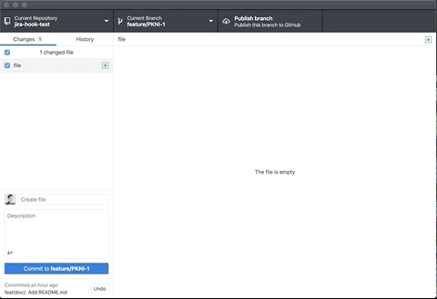

# Git hook for smart commit

Github , Jira 와 연계하여 스마트 커밋을 사용하기위해 hook 설정 파일을 제공합니다.  


## Example for Github ✨


- 개별 레포지토리 이슈인 경우 
```
hotfix/issue-2918 -> (O)
feature/issue-2918 -> (O) 
feature/issues-1281 -> (X)
feature/issues1291 -> (X)
```

위와 같이 `branch`를 생성하고 커밋을 하게되면 자동으로 이슈번호가 커밋에 붙습니다. 

- `hot_issue` 에 등록된 이슈인 경우 
```
hotfix/1820 (O)
hotfix/report-refactoring-1281 (O)
hotfix/migrate-firebase-1289 (O)
feature/migrate-firebase-1289 (O)
```

이슈번호를 넣은 `branch`명을 생성하고 커밋을 하면 자동으로 `[kidsnote/hot_issue#이슈번호]` 가 커밋 앞에 붙습니다. 

##  Example for Jira ✨

- 프로젝트 기능 추가 

```
feature/PKNI-123 (O)
feature/PKNA-123 (O)
feature/PCNI-123 (O)
```

Jira에서 생성된 이슈번호를 가진 `branch`를 생성하고 커밋을 하면 자동으로 프로젝트 이슈번호가 맨 앞에 붙습니다. 
> ⚠️ `feature`, `hofix` 브런치에서만 동작하도록 되어있습니다.


# 사용법 📝

1. 터미널을 엽니다. 
2. 현재 작업중인 프로젝트의 상위 디렉토리로 이동합니다.
3. 아래의 코드를 복사 붙여넣기 합니다.

4. 프로젝트 키가 포함된 `branch`를 생성합니다.  

&nbsp;&nbsp;&nbsp;&nbsp;&nbsp;&nbsp;&nbsp;&nbsp;  


5. 커밋 메세지를 작성합니다.  

&nbsp;&nbsp;&nbsp;&nbsp;&nbsp;&nbsp;&nbsp;&nbsp;

## Github 

```
git init 
```

```
curl https://raw.githubusercontent.com/kidsnote/git_hook/master/github/prepare-commit-msg > .git/hooks/prepare-commit-msg && chmod u+x .git/hooks/prepare-commit-msg
```


## Jira 

```
git init 
```

```
curl https://raw.githubusercontent.com/kidsnote/git_hook/master/jira/prepare-commit-msg > .git/hooks/prepare-commit-msg && chmod u+x .git/hooks/prepare-commit-msg
```

